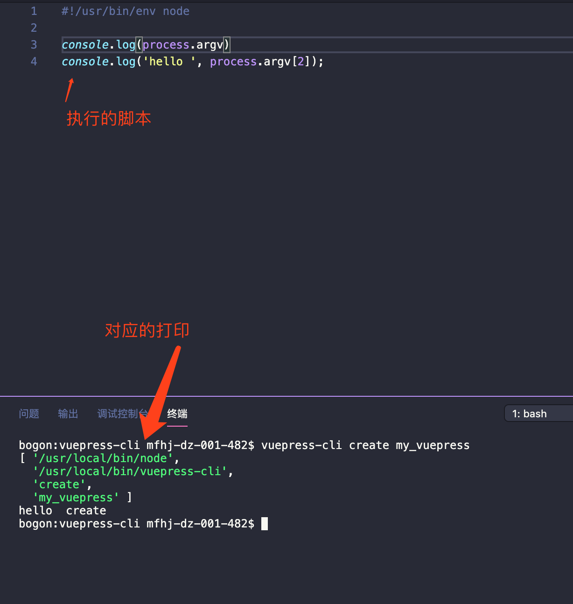

# 命令使我快乐
> 在这里我学会了创建自己的命令
## 创建命令三步走
1. 创建一个index.js文件，并在顶部声明执行环境
```javascript
  // index.js
  #!/usr/bin/env node
  console.log('hello world')
```
添加`#!/usr/bin/env node`或者`#!/usr/bin/node`，这是告诉系统，下面这个脚本，使用`nodejs`来执行。当然，这个系统不包括`windows`，因为`windows`下有个`JScript`的历史遗留物在，会让你的脚本跑不起来。<br />
`#!/usr/bin/env node`的意思是让系统自己去找node的执行程序。<br />
`#!/usr/bin/node`的意思是，明确告诉系统，node的执行程序在路径为/usr/bin/node。

2. npm初始化，并添加bin字段

使用`npm init -y`进行的初始化，在里面增加`bin字段`里面的`属性名可以随意`，后面的值是你要执行的js就可以
```json
  {
      "name": "cli",
      "version": "1.0.0",
      "description": "",
      "main": "index.js",
      "bin": {
          "vuepress-cli": "index.js"
      },
      "scripts": {
          "test": "echo \"Error: no test specified\" && exit 1"
      },
      "keywords": [],
      "author": "",
      "license": "ISC"
  }
```
3. 在当前`package.json目录下`，打开命令行工具，执行`npm link`，将当前的代码在npm全局目录下留个快捷方式。

这样，你的第一个cli脚本就成功安装了，可以在命令行里面，直接敲你的cli名字，看看结果输出吧。
<h2 id='process'>命令行参数的原始写法</h2>

命令行参数可以用系统变量 `process.argv` 获取。
```javascript
  #!/usr/bin/env node
  //index.js
  console.log(process.argv)
  console.log('hello ', process.argv[2]);
```
结果如下
```
$ vuepress-cli create my_vuepress
[ '/usr/local/bin/node',
  '/usr/local/bin/vuepress-cli',
  'create',
  'my_vuepress' ]
hello  create
```

## 多线程
为了充分利用`cpu`资源，或者仅仅是为了使用node创建另一个进程（子进程会复制父进程的内存空间，所以父进程加载过的模块子进程就不需要自己重新加载），我们可以使用node的`child_process`模块。<br />
脚本可以通过 `child_process` 模块新建子进程，从而执行 `Unix` 系统命令。(我个人认为也可以执行`Linux`系统命令，理由是[Linux和UNIX的关系及区别（详解版）](http://c.biancheng.net/view/707.html))
```javascript
#!/usr/bin/env node
var name = process.argv[2];
var exec = require('child_process').exec;

var child = exec('echo hello ' + name, function(err, stdout, stderr) {
  if (err) throw err;
  console.log(stdout);
});
```
结果如下
```
$ vuepress-cli tom
hello tom
```
## shelljs 模块
`shelljs` 模块重新包装了 `child_process`，调用系统命令更加方便。它需要安装后使用。
```javascript
#!/usr/bin/env node
var name = process.argv[2];
var shell = require("shelljs");

shell.exec("echo hello " + name);
```
结果如下
```
$ vuepress-cli tom
hello tom
```
上面代码是 shelljs 的本地模式，即通过 exec 方法执行 shell 命令。此外还有全局模式，允许直接在脚本中写 shell 命令。
```javascript
// 创建文件夹 -p 确保目录存在不存在就创建一个
mkdir('-p', rootName);
cd(rootName);
// npm 初始化
exec("npm init -y");
// 创建README.md文件
touch('README.md')
touch('config.md')
mkdir('-p', 'guide')
cd('guide')
touch('README.md')
cd('..')
mkdir('-p', '.vuepress')
cd('.vuepress')
touch('config.js')
touch('enhanceApp.js')
mkdir('components')
mkdir('theme')
cd('theme')
touch('Layout.vue')
cd('..')
mkdir('public')
mkdir('styles')
cd('styles')
touch('index.styl')
touch('palette.styl')
```
## yargs 模块
上面说到了[命令号参数的原始方法](#process),用`process.argv`来获取参数。npm社区有一些优秀的命令行参数解析包，如 yargs ， commander.js <br />
这里说一下yargs，使用之前需要先下载
```npm
  npm i -S yargs
```


## Q&A
> Q:我是mac系统的我想看看我的命令的脚本文件在哪？

> A:打开文件夹 使用组合快捷键 `Shift + Command + G` 然后输入 `/usr/local/bin/` 回车之后就可以在面找到你脚本名字对应的文件了
# 感谢
* 简书作者：CharTen
* 文章地址：[手把手教你使用nodejs编写cli(命令行)](https://www.jianshu.com/p/095c968d406f)
* 简书作者：转角遇见一直熊
* 文章地址：[Node介绍9-进程](https://www.jianshu.com/p/bab51f47b419)
* 文章来源：C语言中文网
* 文章地址：[Linux和UNIX的关系及区别（详解版）](http://c.biancheng.net/view/707.html)
* 文章作者：阮一峰
* 文章地址：[Node.js 命令行程序开发教程](http://www.ruanyifeng.com/blog/2015/05/command-line-with-node.html)
* 文章来源：脚本之家
* 文章地址：[如何从0开始用node写一个自己的命令行程序](https://www.jb51.net/article/153745.htm)
* 文章来源：github
* 文章地址：[命令行参数解析包connander.js](https://github.com/tj/commander.js/blob/master/Readme_zh-CN.md)